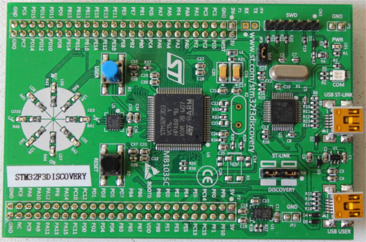

# 认识你的硬件

让我们先熟悉一下将要使用的硬件。

## STM32F3DISCOVERY ("F3")

这块板子上有哪些东西?

- 一颗 [STM32F303VCT6](https://www.st.com/en/microcontrollers/stm32f303vc.html) 微控制器 (Microcontroller, MCU). 这颗微控制器包含:
  - 一个单核 ARM Cortex-M4F 处理器, 硬件支持单精度浮点运算, 最高时钟频率 72 MHz.

  - 256 KiB 的 "Flash" 存储器. (1 KiB = 10**24** 字节)

  - 48 KiB 的 RAM.

  - 多种集成外设 (Peripheral), 如定时器、I2C、SPI 和 USART.

  - 通用输入输出 (General Purpose Input Output, GPIO) 以及其他类型的引脚, 可通过板子两侧的两排排针访问.
  
  - 一个 Mini-USB 接口, 通过标有 "USB USER" 的 USB 端口引出.

- 一个 [加速度计 (Accelerometer)](https://en.wikipedia.org/wiki/Accelerometer), 是 [LSM303DLHC](https://www.st.com/en/mems-and-sensors/lsm303dlhc.html) 芯片的一部分.

- 一个 [磁力计 (Magnetometer)](https://en.wikipedia.org/wiki/Magnetometer), 是 [LSM303DLHC](https://www.st.com/en/mems-and-sensors/lsm303dlhc.html) 芯片的一部分.

- 一个 [陀螺仪 (Gyroscope)](https://en.wikipedia.org/wiki/Gyroscope), 是 [L3GD20](https://www.pololu.com/file/0J563/L3GD20.pdf) 芯片的一部分.

- 8 个用户 LED, 排列成指南针的形状.

- 第二个微控制器: 一颗 [STM32F103](https://www.st.com/en/microcontrollers/stm32f103cb.html). 这颗微控制器实际上属于板载的编程器 / 调试器的一部分, 与标有 "USB ST-LINK" 的 Mini-USB 端口相连.

更详细的功能列表和板子的进一步规格说明, 请查看 [STMicroelectronics](https://www.st.com/en/evaluation-tools/stm32f3discovery.html) 官网.

温馨提示: 如果你想给板子接入外部信号, 请务必小心. STM32F303VCT6 微控制器的引脚标称电压为 3.3 V. 更多信息请参阅 [手册中的 6.2 绝对最大额定值章节](https://www.st.com/resource/en/datasheet/stm32f303vc.pdf)
