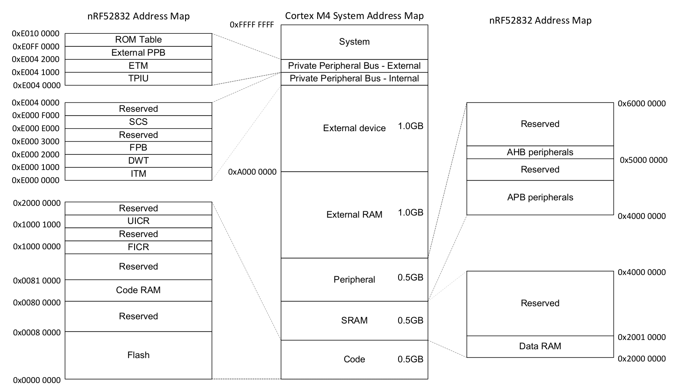
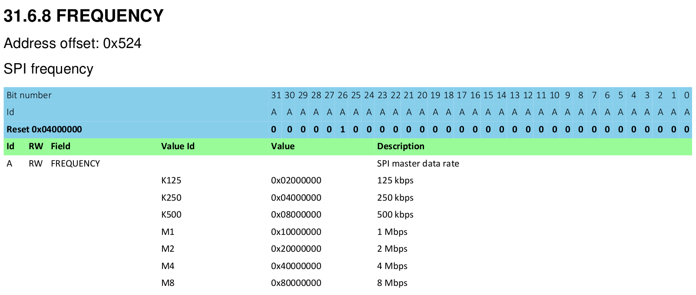

# 外设 (Peripherals)

## 什么是外设 (Peripherals)?

大多数微控制器 (Microcontroller) 不仅仅包含 CPU、RAM 或 Flash Memory, 它们还包含一些硅片区域, 用于与微控制器外部的系统交互, 以及通过传感器、电机控制器或显示器、键盘等人机界面与外部世界直接或间接交互. 这些组件统称为外设 (Peripherals).

这些外设非常有用, 因为它们允许开发者将处理任务卸载到外设上, 避免在软件中处理一切. 类似于桌面开发者将图形处理卸载到显卡上, 嵌入式开发者可以将某些任务卸载到外设, 让 CPU 腾出时间来做其他重要的事情, 或者什么都不做以节省功耗.

如果你查看 1970 或 1980 年代老式家用电脑的主电路板 (其实, 昨天的桌面 PC 与今天的嵌入式系统并没有太大区别), 你会看到:

* 一个处理器
* 一块 RAM 芯片
* 一块 ROM 芯片
* 一个 I/O 控制器

RAM 芯片、ROM 芯片和 I/O 控制器 (即该系统中的外设) 通过一系列称为"总线 (Bus)"的并行走线连接到处理器. 该总线承载地址信息, 用于选择处理器希望与之通信的总线上的设备, 以及承载实际数据的数据总线. 在我们的嵌入式微控制器中, 原理相同 — 只是所有东西都封装在一块硅片上.

然而, 与通常具有 Vulkan、Metal 或 OpenGL 等软件 API 的显卡不同, 外设通过硬件接口暴露给微控制器, 该接口被映射到一块内存.

## 线性和真实内存空间

在微控制器上, 向某个任意地址 (例如 `0x4000_0000` 或 `0x0000_0000`) 写入一些数据, 也可能是一个完全有效的操作.

在桌面系统中, 内存访问由 MMU (Memory Management Unit, 内存管理单元) 严格控制. 该组件有两个主要职责: 强制对内存区域的访问权限 (防止一个进程读取或修改另一个进程的内存); 以及将物理内存段重新映射为软件中使用的虚拟内存范围. 微控制器通常没有 MMU, 而是在软件中只使用真实的物理地址.

虽然 32 位微控制器具有从 `0x0000_0000` 到 `0xFFFF_FFFF` 的真实且线性的地址空间, 但它们通常只使用该范围的几百 KB 作为实际内存. 这留下了大量的地址空间. 在前面的章节中, 我们提到 RAM 位于地址 `0x2000_0000`. 如果我们的 RAM 长 64 KiB (即最大地址为 0xFFFF), 那么地址 `0x2000_0000` 到 `0x2000_FFFF` 就对应我们的 RAM. 当我们写入一个位于地址 `0x2000_1234` 的变量时, 内部发生的事情是, 某些逻辑检测到地址的高位部分 (本例中为 0x2000), 然后激活 RAM, 以便它可以作用于地址的低位部分 (本例中为 0x1234). 在 Cortex-M 上, 我们的 Flash ROM 也被映射在地址 `0x0000_0000` 到例如 `0x0007_FFFF` (如果我们有 512 KiB 的 Flash ROM). 微控制器设计者并没有忽略这两个区域之间所有剩余的空间, 而是将外设的接口映射到了某些内存位置. 最终看起来像这样:

[Nordic nRF52832 Datasheet (pdf)]

## 内存映射外设 (Memory Mapped Peripherals)

乍看之下, 与这些外设的交互很简单 — 将正确的数据写入正确的地址. 例如, 通过串行端口发送一个 32 位字可以直接写一个 32 位字到某个内存地址. 然后串行端口外设将接管并自动发送数据.

这些外设的配置工作方式类似. 我们不是调用一个函数来配置外设, 而是暴露一块内存作为硬件 API. 向 SPI Frequency Configuration Register (SPI 频率配置寄存器) 写入 `0x8000_0000`, SPI 端口将以每秒 8 兆比特的速度发送数据. 向同一地址写入 `0x0200_0000`, SPI 端口将以每秒 125 千比特的速度发送数据. 这些配置寄存器看起来有点像这样:

[Nordic nRF52832 Datasheet (pdf)]

无论使用什么语言 (汇编语言、C 或 Rust), 这种接口都是与硬件交互的方式.

[Nordic nRF52832 Datasheet (pdf)]: http://infocenter.nordicsemi.com/pdf/nRF52832_PS_v1.1.pdf
