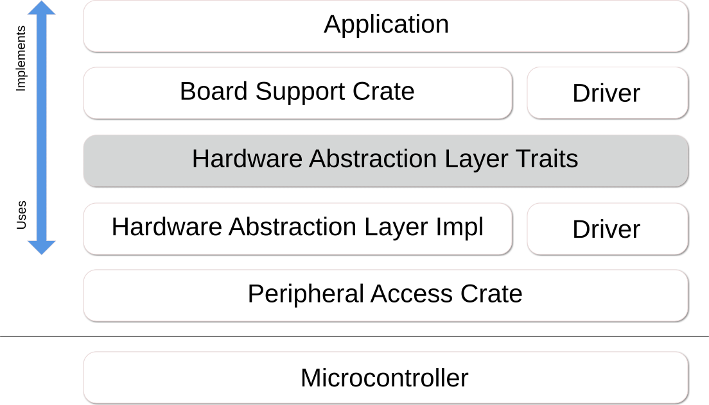

# 可移植性 (Portability)

在嵌入式环境中, 可移植性 (Portability) 是一个非常重要的话题: 每个供应商, 甚至同一制造商的每个系列, 都提供不同的外设和功能, 类似地, 与外设交互的方式也会有所不同.

一种消除这些差异的常用方法是通过一个称为硬件抽象层 (Hardware Abstraction Layer) 或 **HAL** 的层.

> 硬件抽象是软件中的一组例程, 它们模拟某些平台特定的细节, 为程序提供对硬件资源的直接访问.
>
> 它们通常允许程序员通过提供对硬件的标准操作系统 (OS) 调用来编写与设备无关的高性能应用程序.
>
> *Wikipedia: [Hardware Abstraction Layer]*

[Hardware Abstraction Layer]: https://en.wikipedia.org/wiki/Hardware_abstraction

嵌入式系统在这方面有点特殊, 因为我们通常没有操作系统和用户可安装的软件, 但固件 (Firmware) 映像是作为一个整体编译的, 还有一些其他约束. 因此, 虽然 Wikipedia 定义的传统方法可能可行, 但它可能不是确保可移植性的最高效方法.

我们在 Rust 中如何做到这一点? 来看看 **[embedded-hal]**...

## 什么是 [embedded-hal]?

简而言之, 它是一组 trait, 定义了 **HAL 实现 (HAL Implementations)**、**驱动 (Drivers)** 和 **应用程序 (或固件) (Applications (or firmwares))** 之间的实现契约 (Implementation Contracts). 这些契约既包括能力 (即如果为某个类型实现了一个 trait, 则 **HAL 实现**提供某种能力), 也包括方法 (即如果你能构造一个实现了某个 trait 的类型, 则保证你可以使用该 trait 中指定的方法).

典型的分层可能看起来像这样:

**[embedded-hal]** 中定义的一些 trait 包括:
* GPIO (输入和输出引脚)
* 串行通信 (Serial Communication)
* I2C
* SPI
* 定时器/倒计时 (Timers/Countdowns)
* 模数转换 (Analog Digital Conversion)

拥有 **embedded-hal** trait 以及实现和使用它们的 crate 的主要原因是为了控制复杂性. 如果考虑到应用程序可能既要在硬件中实现外设的使用, 又要实现应用程序本身, 并且可能还要实现附加硬件组件的驱动, 那么你应该很容易看出可重用性是非常有限的. 用数学方式来表达, 如果 **M** 是外设 HAL 实现的数量, **N** 是驱动的数量, 那么如果我们要为每个应用程序重新发明轮子, 我们最终将得到 **M*N** 个实现, 而通过使用 **[embedded-hal]** trait 提供的 *API*, 将使实现复杂度趋近于 **M+N**. 当然还有其他好处, 比如由于定义良好且现成可用的 API, 可以减少反复试错.

## [embedded-hal] 的用户

如上所述, HAL 有三个主要用户:

### HAL 实现

HAL 实现提供了硬件和 HAL trait 用户之间的接口. 典型的实现由三部分组成:
* 一个或多个硬件特定类型
* 用于创建和初始化此类类型的函数, 通常提供各种配置选项 (速度、操作模式、使用的引脚等)
* 该类型的一个或多个 **[embedded-hal]** trait 的 `impl`

这样的 **HAL 实现**可以有多种形式:
* 通过低级硬件访问, 例如通过寄存器
* 通过操作系统, 例如在 Linux 下使用 `sysfs`
* 通过适配器, 例如用于单元测试的类型的 mock
* 通过硬件适配器的驱动, 例如 I2C 多路复用器或 GPIO 扩展器

### 驱动

驱动为连接到实现 [embedded-hal] trait 的外设的内部或外部组件实现一组自定义功能. 这种驱动的典型例子包括各种传感器 (温度、磁力计、加速度计、光线), 显示设备 (LED 阵列、LCD 显示器) 和执行器 (电机、发射器).

驱动必须使用实现 [embedded-hal] 某个 `trait` 的类型实例进行初始化, 这通过 trait bound 来保证, 并提供它自己的类型实例, 其中包含一组允许与被驱动设备交互的自定义方法.

### 应用程序

应用程序将各个部分绑定在一起, 并确保实现期望的功能. 当在不同的系统之间移植时, 这是需要最多适配工作的部分, 因为应用程序需要通过 HAL 实现正确初始化真实的硬件, 而不同硬件的初始化是不同的, 有时差异巨大. 此外, 用户的选型往往也起着重要作用, 因为组件可以物理上连接到不同的端子, 硬件总线有时需要外部硬件来匹配配置, 或者在使用内部外设时需要做出不同的权衡 (例如, 有多个具有不同功能的定时器可用, 或者外设之间存在冲突).

[embedded-hal]: https://crates.io/crates/embedded-hal
